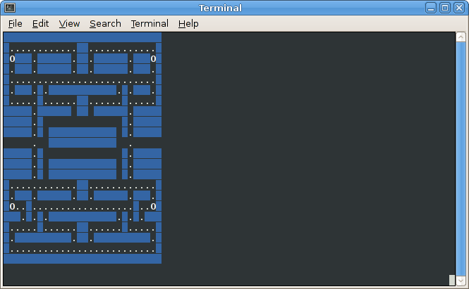
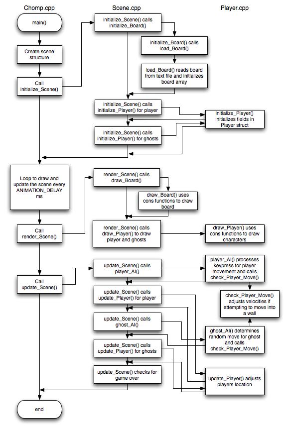

**Milestone 1: Due Thursday, Nov 29th by 11:59 PM**

**Milestone 2: Due Thursday, Dec 6th by 11:59 PM**

Getting Started
===============

Start by downloading [CS101_Assign06.zip](CS101_Assign06.zip), saving
it in the directory **H:\\CS101**.

Start a **Cygwin Bash Shell** and run the following commands:

    cd h:
    cd CS101
    unzip CS101_Assign06.zip
    cd CS101_Assign06

Using **Notepad++**, open the files

> **H:\\CS101\\CS101\_Assign06\\Scene.h**

> **H:\\CS101\\CS101\_Assign06\\Scene.cpp**
		
> **H:\\CS101\\CS101\_Assign06\\Player.h**

> **H:\\CS101\\CS101\_Assign06\\Player.cpp**

You will add your code to these files. *Note:* we will be using separate files for the game play, scene structure, and player structures. 

The file **Chomp.cpp** contains the provided game loop, and the file **Const.h** includes symbolic constants to use throughout the program. You should not need to modify either of these files.

A sample Windows executable is included in the .zip file and can be run in Cygwin by

    ./ChompSolWin
	
or for Linux in a terminal window

    ./ChompSolLinux
	
(there is also a sample executable compiled for Mac as ChompSolMac but it may be a bit erratic).

When you are ready to compile the program, in the Cygwin window type the command

    make

To run the program, in the Cygwin window type the command

    ./Chomp.exe

Your Task
=========

Since many of you have either played or at least seen the retro arcade game [Pacman](http://en.wikipedia.org/wiki/Pacman), the purpose of this assignment is to write a similar game using terminal graphics. The object of the game is to move your player around a board collecting pellets and power-ups while avoiding the 4 ghosts. 

Initializing the Board
----------------------

Code has been provided to load in the game board and display it on the screen. 

The following fields are defined in the **Scene** structure (in **Scene.h**)

-   a 2D **int** array for the board
-   an **int** for the number of pellets	
-   an **int** for the number of powerups
	
*Loading in the board*

The layout of the board is included in the text file **board.txt** where
**+** indicates walls, **.** indicates pellets, and **O** indicates
power ups.

The **initialize_Scene()** function takes a **Scene** structure as a
reference parameter. The function calls **load_Board()** passing
the board, number of pellets, and number of powerup fields
by reference. **load_board()** reads the file and initializes
a 2D board array parameter with the objects at each board
location. Each element of the array will contain a symbolic
constant for the object at that location as either:

-   **WALL** - for a wall
-   **PELLET** - for a pellet
-   **POWER_UP** - for a powerup
-   **EMPTY** - for an empty corridor

The function will also return the number of pellets (**num_pellets**)
and number of power-ups (**num_powerups**) the board contains through reference parameters.

**initialize_Scene()** will be modified in the milestones to perform other
initializations for the player and ghosts.
 
*Drawing the board*

The **render_Scene()** function then takes a **Scene** as a reference parameter and calls the **draw_Board()** function passing the **board** field from the **Scene *s** parameter.

The **draw_Board()** function takes a 2D array of **int**'s representing the board and renders the board on the screen. Symbolic constants have been defined for the characters to render as:

>-   **WALL_CHAR** - a blank space
>-   **PELLET_CHAR** - a period
>-   **POWER_CHAR** - an uppercase O

You should see something
like this when you run the program:

> 

## Milestone 1

**Milestone 1** will add the player and allow them to move around the board.

You will need to first create a structure named **Player** and then add the following fields to the **Player** structure (in **Player.h**)

-   an **int** for the player's current x location
-   an **int** for the player's current y location
-   an **int** for the player's current dx velocity
-   an **int** for the player's current dy velocity
-   a **char** for the player's character symbol
-   an **int** for the player's color

### Player functions

We will need to add functions to initialize, draw and update the fields of the player.

-   Add a function to **Player.cpp** (placing the prototype in **Player.h**) named **initialize_Player()** which takes a **Player** structure as a pointer parameter, two **int** parameters for the starting x and y location, two **int** parameters for the starting dx and dy velocities, one **char** parameter for the player's character symbol, and one **int** parameter for the player's color. The function should initialize all the fields of the **Player** structure with the corresponding parameters. **Hint:** Since we have a *pointer* to a **Player**, we need to use **->** to access the fields.  

-   Add a function to **Player.cpp** (placing the prototype in **Player.h**) named **draw_Player()** which takes a **Player** structure as a pointer parameter. The function should move the cursor to the player's current location, set the color for the player, and draw the player using their symbol (from the fields in the structure). **Hint:** Use the terminal graphics commands, see [Lab 17](../labs/lab17.html) for the commands, and note that *y* is the *row* and *x* is the *col*. Since we have a *pointer* to a **Player**, we need to use **->** to access the fields.

-   Add a function to **Player.cpp** (placing the prototype in **Player.h**) named **player_AI()** which takes a **Player** structure as a reference parameter and a 2D array of **int**'s for the board (use **WIDTH** and **HEIGHT** for the dimensions). The function should call the **cons_get_keypress()** terminal graphics function which checks to see if the user has pressed a key and if so, returns an **int** for the key that was pressed (or -1 if no key was pressed). Symbolic constants are defined for the arrow keys as **UP_ARROW**, **DOWN_ARROW**, **LEFT_ARROW**, and **RIGHT_ARROW** (in **Console.h**). Based on the key that was pressed, the player's *velocity* fields, i.e. **dx** and **dy** should be set appropriately (or set to 0 if no key was pressed). The function should then call **check_Player_Move()** (discussed below) to validate desired move. **Hint:** Start by setting both **dx** and **dy** to 0. Then left and right movements should set **dx**, and up and down movements should set **dy**. Since we have a *pointer* to a **Player**, we need to use **->** to access the fields. The player is already a *pointer*, so to pass it to **check_Player_Move()** we *do not* need the **&**.

-   Add a function to **Player.cpp** (placing the prototype in **Player.h**) named **check_Player_Move()** which takes a **Player** structure as a reference parameter and a 2D array of **int**'s for the board (use **WIDTH** and **HEIGHT** for the dimensions). The function should determine if the player is attempting to move into a wall (setting the velocities to 0 if they are) or moving through the tunnel which is at the edge of the board with y location given by the symbolic constant **TUNNEL_Y**. If they have entered the tunnel, the player's position should be changed to the opposite side of the board. **Hint:** Determine the player's desired new position and use those as *indicies* in the **board** array to check if that location is **WALL**. Since we have a *pointer* to a **Player**, we need to use **->** to access the fields.
	
-   Add a function to **Player.cpp** (placing the prototype in **Player.h**) named **update_Player()** which takes a **Player** structure as a reference parameter. The function should update the player's current location based on their current velocity. **Hint:** Since we have a *pointer* to a **Player**, we need to use **->** to access the fields.

### Scene functions

Next we need to incorporate the player into the scene. 

-   Add a **Player** field to the **Scene** structure for the user

-   Add code to **initialize_Scene()** to call **initialize_Player()** for the user. The arguments in the function call should initialize the fields of the structure so the player starts at location (**PLAYER_HOME_X**, **PLAYER_HOME_Y**) with both velocity components equal to 0 (i.e. not moving). The player's symbol and color should be initialized with **PLAYER_CHAR** and **PLAYER_COLOR** (which are defined in **Const.h** if you wish to change them). **Hint:** Since the **s** parameter is a *pointer* to a scene, use **->** to access the player field. However, since we need to pass the player field *by reference*, use the **&** as well, e.g. if the player field is **p** then the argument would be **&(s->p)**.
	
-   Add code to **render_Scene()** to call **draw_Player()** to draw the player on the board (note this should be done *after* drawing the board). **Hint:** Since the **s** parameter is a *pointer* to a scene, use **->** to access the player field. However, since we need to pass the player field *by reference*, use the **&** as well, e.g. if the player field is **p** then the argument would be **&(s->p)**.

-   Add code to **update_Scene()** (which takes a **Scene** structure as a reference parameter and returns an *int* value which will be a flag indicating when the game is over) to call the player's **player_AI()** function to see if they have pressed a key (which determines the player's desired velocity and computes their actual velocities) and then **update_Player()** to update the player's current location based on their velocities. The function should then determine if the player has ended up on a pellet or power-up and adjust the board (along with the pellet or power-up counters) accordingly. **Hint:** Since the **s** parameter is a *pointer* to a scene, use **->** to access the player field. However, since we need to pass the player field *by reference*, use the **&** as well, e.g. if the player field is **p** then the argument would be **&(s->p)**.

At this point you should be able to move the player around the board "gobbling" up the pellets and power-ups.
	
## Milestone 2

**Milestone 2** incorporates the ghosts to complete the game play. The ghosts will simply be represented by an *array* of **Player**'s that uses a different function to determine their desired velocities (basic AI).

You will need to first add a field to the **Scene** structure (in **Scene.h**)

-   an array of type **Player** for the ghosts. It should be of size **NUM_GHOSTS** (a symbolic constant in **Const.h**).

and the **Player** structure (in **Player.h**)

-   an *int* for the player's score

### Player functions

Note the **draw_Player()**, **check_Player_Move()**, and **update_Player()** functions can be used for both the user and ghosts without modification.

-   Add code to **initialize_Player()** to initialize the score field.

-   Add a function to **Player.cpp** (placing the prototype in **Player.h**) named **ghost_AI()** which takes a **Player** structure as a reference parameter and a 2D **int** array for the board. The function should simply keep the current velocities the same with a probablity of 75% (unless *both* the current velocities are 0), otherwise the velocities should be set by generating random values of +1 or -1 for *either* dx or dy (but not both as the ghosts cannot move diagonally). Similarly to **player_AI()**, the function should then call **check_Player_Move()** to determine the actual velocity for the ghost, i.e. make sure it is not trying to move into a wall and/or adjust for going through the tunnel.

### Scene functions

-   Add code to **initialize_Scene()** to call **initialize_Player()** for *each* of the ghosts, i.e. for each element of the ghost array. The arguments in the function call should initialize the fields of the structure so the ghosts start at a random x location within two units of **GHOST_HOME_X** with the same y location **GHOST_HOME_Y**. The velocity components should be randomly set to either +1 or -1 for dx and 0 for dy (i.e. randomly moving left or right). The ghost symbol and color should be initialized to **GHOST_CHAR** and **GHOST_COLOR** (from **Const.h**).
	
-   Add code to **render_Scene()** to call **draw_Player()** to draw the ghosts on the board (note this should be done *after* drawing the board but can be either before or after drawing the player). Also add drawing code to display the player's score next to the board.
	
-   Add code to **update_Scene()** to call the functions for the ghosts (with the only difference being that **ghost_AI()** is used instead of **player_AI()**). Additionally after updating each ghost, you should check if the player has ended up on a ghost and return "true" to end the game. Update the player's score if they have moved onto a pellet or power_up by amounts **PELLET_VAL** and **POWER_VAL**.  The game should also end once there are no more pellets and power-ups remaining on the board.

At this point you will have a playable game, but the ghosts will move extremely fast (although not very intelligently). To make the ghosts move at a more reasonable speed, determine a way to only update them every GHOST_DELAY (another constant in **Const.h**) update cycles. Hint: consider adding a counter field to the **Scene** structure and checking it in **update_Scene()**.

Grading
=======

Your grade will be determined as follows:

### Milestone 1 - 75 points

* Player struct: 5
* initialize_Player(): 10
* draw_Player(): 10
* player_AI(): 15
* check_Player_Move(): 15
* update_Player(): 10
* call **Player** functions in **Scene**: 10

### Milestone 2 - 75 points

* Ghosts array and score field: 5
* initialize score: 5
* ghost_AI(): 20
* initialize ghosts: 15
* draw ghosts and score: 10
* update ghosts: 10
* check for game over: 10

We expect you to use good coding style.  Points may be deducted for poor variable names, inconsistent or missing indentation, and/or lack of comments.
		
### Extra Credit - 45 points  

*Improve the ghost AI* - 10 points

One drastic improvement that can be made to the ghost AI is rather than select a random direction to attempt to move (which often results in moving into a wall), select only from the valid directions the ghost can move (with a strong preference to continue moving forward, a lesser preference to turn if possible, and with a relatively small preference to turn around). This will make the ghost movement appear much smoother (and smarter). Additionally the ghost's prefered direction can be further biased towards the player if they are within a certain range of the player (basically providing a "chase" mode when they are close). There should be a small probability that the ghost will stop chasing otherwise the game will become very difficult to play (the ghosts will essentially ambush the player pinning him in a corner).

*Additional levels* - 10 points

Alternate levels can be designed using the same symbols as **board.txt**, i.e. **+** for walls, **.** for pellets, **O** for power-ups, and blanks for empty locations. Make sure your boards are 28 characters wide by 22 characters high (to match the board array used in the **load_Board()** function). Be careful if you choose to use tunnels that they are at row **TUNNEL_Y** otherwise you will need to modify the **check_Player_Move()** function. Once a level is completed, load and begin another level.

*Capturable ghosts* - 25 points

Probably the most complicated improvement (in the spirit of the original video game) is to allow the ghosts to be "captured" for a brief period of time after the player "eats" a power-up. If the player and ghost are at the same location during this time, the player earns extra points and the ghost is returned to its home location while no longer being capturable. The player should receive some type of warning that the capturable time is about to expire. In the original game, the ghosts would turn blue while they were capturable and flash when they were about to become non-capturable. Consider adding flags to the **Player** structure that tracks the state of each ghost and a counter to the **Scene** structure that is set to a value and counts down whenever a power-up is eaten (and can be used to determine when to make the ghosts "flash").

## Program structure

Note: The board size is set by the symbolic constants **WIDTH** (=28) and **HEIGHT** (=22) which can be used when accessing the elements of the 2D array.

The overall layout of the program can be graphically illustrated by the following flowchart showing the relationships between the functions and which files they should be placed in:

> 

Submitting
==========

To submit your code, make sure all the files are saved, and in the Cygwin window type one of the following commands (depending on whether you are submitting **Milestone 1** or **Milestone 2**).

For **Milestone 1**:

    make submit_ms1

File **Milestone 2**:

    make submit_ms2

Enter your Marmoset username and password (which you should have received by email.) Note that your password will not be echoed to the screen. Make sure that after you enter your username and password, you see a message indicating that the submission was successful.

If the **make** commands above do not work, you can [submit using the web interface](../submitting.html) (see the link for details).

Make sure that you check the file(s) you submitted to ensure that they are correct.  See the instructions for [Verifying your submission](../submitting.html#verifying-your-submission).