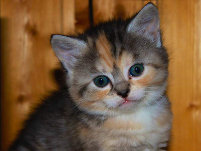
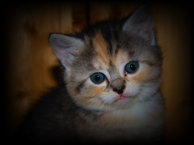
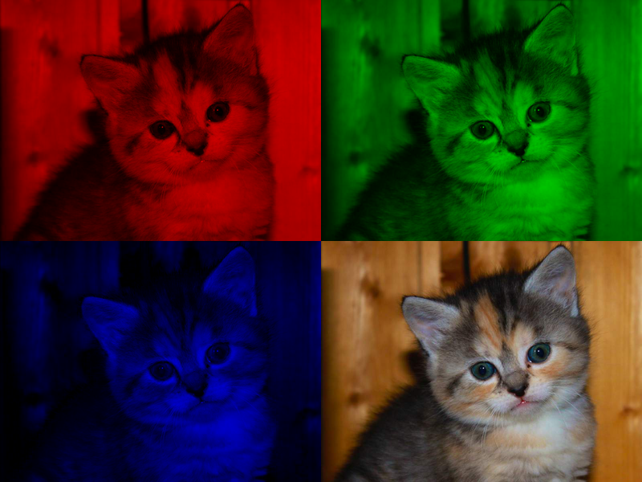

Getting Started
===============

Refer to [Lab 1](lab01.html) if you need a reminder about how to start **Cygwin Terminal** or **Notepad++**.

Start by downloading [CS101\_Lab13.zip](CS101_Lab13.zip), saving it in the directory **H:\\CS101**.

Start a **Cygwin Terminal** and run the following commands:

    cd h:
    cd CS101
    unzip CS101_Lab13.zip
    cd CS101_Lab13

Using **Notepad++**, open the files

> **H:\\CS101\\CS101\_Lab13\\Grayscale.cpp**
>
> **H:\\CS101\\CS101\_Lab13\\Fade.cpp**
>
> **H:\\CS101\\CS101\_Lab13\\RGB.cpp**

To compile the programs, run the command

    make

To run a program, use one of the following commands (as appropriate):

    ./Grayscale.exe
    ./Fade.exe
    ./RGB.exe

Your Task
=========

In this lab, you will write programs to transform a photo of an adorable kitten (source: [placekitten.com](http://placekitten.com/640/480)):

> 

This image is included in the lab as a file called **kitten.bmp**.

Each of the three programs looks like this:

**WIDTH** and **HEIGHT** are constants representing the width (400 pixels) and height (300 pixels) of the photo. The **ReadImage** function reads the data representing each pixel of the kitten photo, and stores them into arrays called **red**, **green**, and **blue**.

There are three arrays because each pixel of the image is broken into red, green, and blue color component values. (These are the three basic colors that the human eye can see.) For the pixel at column *i* and row *j* of the photo,

> **red[i][j]** is the red component of the pixel
>
> **green[i][j]** is the green component of the pixel
>
> **blue[i][j]** is the blue component of the pixel

Each color component value is an integer in the range 0..255. 0 is the least intense value, and 255 is the most intense value.

You can transform the image by adding code at the **TODO** comment to change the values in the array.  For the first two programs (**Grayscale.cpp** and **Fade.cpp**), you will store transformed values directly in the **red**, **green**, and **blue** arrays.  For the third program (**RGB.cpp**), you will store the transformed values in the **red\_out**, **green\_out**, and **blue\_out** arrays.

The **WriteImage** function (or **WriteImageDoubleSize** function in the third program) will generate a new image file based on the transformed color values computed by your program. You can use a web browser to view the transformed image. (Press **Control-O** in the web browser to bring up the open file dialog, and choose the output file you want to view.)

Grayscale
---------

In the program **Grayscale.cpp**, transform the image to a grayscale image:

> 

Here is how to do this. Gray colors are generated by creating pixels where the red, green, and blue values are equal. Let's say that we are transforming the pixel at column *i* and row *j*. Let *r* be the red component, *g* be the green component, and *b* be the blue component. Each component of the pixel should be changed to equal an integer close to

> (0.31 &times; *r*) + (0.5 &times; *g*) + (0.19 &times; *b*)

Run the program as

    ./Grayscale.exe

View the resulting image by opening **grayscale.bmp** in your web browser.

Fade
----

In the program **Fade.cpp**, implement a nifty [Instagram](http://instagram.com/)-style fade effect:

> 

[Note: if, like Instagram, you can turn this idea into a billion-dollar company, please consider giving your CS 101 instructor an equity stake.]

Here's how to do this. For a pixel at column *i* and row *j*, compute *hdist* and *vdist* values:

> *hdist* = (*i*+1) / **WIDTH**
>
> *vdist* = (*j*+1) / **HEIGHT**

*hdist* and *vdist* represent the relative distance of the pixel from the left edge and top edge of the image, respectively, in the range 0..1. (Be careful to use floating point operations rather than integer operations to compute these values.)

Next, compute the *fade* coefficient as

> *fade* = sin(*hdist* &times; **M\_PI**) &times; sin(*vdist* &times; **M\_PI**)

Finally, change the red, green, and blue component values for the pixel by replacing them with a value that is an integer close to *fade* times their original value. The *fade* coefficient will darken pixels that are closer to the edges of the image.

Run the program as

    ./Fade.exe

View the resulting image by opening **fade.bmp** in your web browser.

RGB - Extra Challenge
---------------------

In the program **RGB.cpp**, create a large image with 4 copies of the original image. The top left, top right, and bottom left copies should preserve only the red, green, and blue color component values, leaving the other component values as 0. The bottom right copy should be identical to the original image.  So, it should look like the following image (click for full size):

> 

Note that this program uses larger arrays called **red\_out**, **green\_out**, and **blue\_out** to store the output image, with twice the number of rows and columns as the original arrays. So, in this program, you will set values in the the output arrays rather than modifying the value in the original input arrays.

**Useful hint**: You may assume that all of the elements of the **red\_out**, **green\_out**, and **blue\_out** arrays will be set to 0 initially.

Run the program as

    ./RGB.exe

View the resulting image by opening **rgb.bmp** in your web browser.

Submitting
==========

To submit your work, type the command

    make submit

Enter your Marmoset username and password (which you should have received by email.) Note that your password will not be echoed to the screen.
