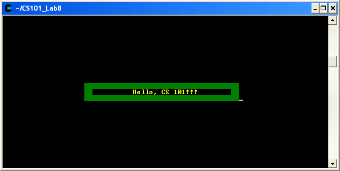

Getting Started
===============

Refer to [Lab 1](lab01.html) if you need a reminder about how to start **Cygwin Terminal** or **Notepad++**.

Start by downloading [CS101\_Lab18.zip](CS101_Lab18.zip), saving it in the directory **H:\\CS101**.

Start a **Cygwin Terminal** and run the following commands:

    cd h:
    cd CS101
    unzip CS101_Lab18.zip
    cd CS101_Lab18

Using **Notepad++**, open the file

> **H:\\CS101\\CS101\_Lab18\\FancyOutput.cpp**

Run the command

    make

when you are ready to compile the program. To run the program, run the command

    ./FancyOutput.exe

Your Task
=========

Your task is to modify the **main** function in **FancyOutput.cpp** so that it displays the following output:

> 

Your program's output doesn't have to match this screenshot exactly, but it should be similar.

Instead of using the **printf** function to print output to the screen, use the following functions:

**cons\_move\_cursor(** *row*, *col* **)**

Move the cursor to a specified row and column of the screen. Row and column values start at 0. The default size of the output window is 80 columns by 25 rows.

**cons\_change\_color(** *foreground*, *background* **)**

Change the displayed text color to the given foreground and background colors. Possible colors are **BLACK**, **RED**, **GREEN**, **YELLOW**, **BLUE**, **MAGENTA**, **CYAN**, and **GRAY**. You can add the special value **INTENSE** to a color to create a brighter color.

**cons\_printw(** *format* [, *values* ] **)**

This function works just like **printf**, except that it works with the previous functions to allow arbitrary placement and coloring of printed text.

For example:

    cons_change_color(YELLOW+INTENSE, BLACK);
    cons_move_cursor(12, 32);
    cons_printw("Hello, CS 101!!!");

This code prints **Hello, CS 101!!!** in bright yellow text on a black background near the middle of the output window.

Hints
=====

You can draw solid blocks of color by using **cons\_change\_color** to set the background to the color you want to draw, and then using **cons\_printw** to print space characters.

Submit
======

Submit using

    make submit

and enter your Marmoset username and password when prompted.
