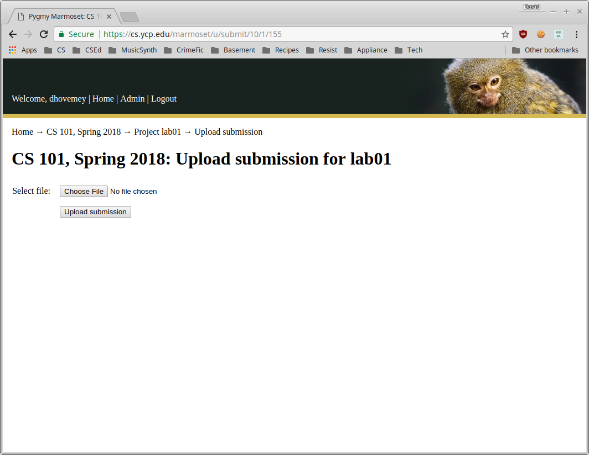

This document describes how to submit labs and assignments to Marmoset.

# Using make

All of the labs and assignments allow submission using the **make** command.  You should run this command (in Cygwin terminal) from within the lab or assignment directory.

For labs and assignments that do *not* have multiple milestones, the command will be

    make submit

For labs and assignments that *do* have multiple milestones, the command will depend on the milestone.  For example, to submit milestone 1, you would use the command

    make submit_ms1

Refer to the assignment description for specific information on how to submit milestones.

# Using the web interface

If submission using **make** is not working, you can upload your submission directly using the Marmoset web interface.

First, run the commands

    make clean
    make solution.zip

from the lab or assignment directory.  This will create a zipfile with all of the files to be submitted.

Next, log into Marmoset.  The URL is

> [https://cs.ycp.edu/marmoset](https://cs.ycp.edu/marmoset)

Click on the course link.  You should see a list of labs and assignments, something like the following (click for full size):

> 

Click on the Project link for the lab or assignment you want to submit.  You should see a page something like the following:

> 

Click on the **Upload new submission** link.  You should see a page something like the following:

> 

At this point you should be able to upload the **solution.zip** file you created earlier.  Once you have successfully submitted the file, you should see a confirmation message:

> 

At this point you should verify that you submitted the correct files: see the next section.

# Verifying your submission

Once you have submitted your work, you should verify that you submitted the correct files.  Start by logging into Marmoset and following the link to the CS 101 course.  Click on the lab or assignment you want to verify (e.g., **lab01**, **assign02\_ms1**, **assign04**, etc.)  You should see a list of your submissions that looks something like the following (click for full size):

> 

Click the link for the submission you would like to check (e.g., "Submission 1").  You should see a list of files:

> 

Click on the file you want to verify (e.g., "hello.cpp"):

> 
